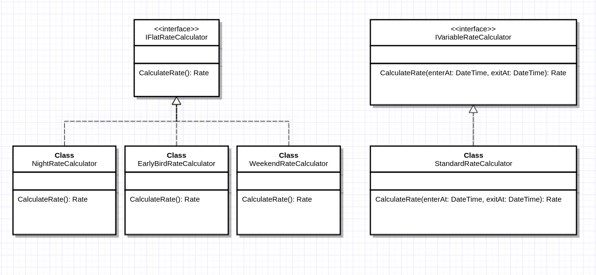

# Car Park Rate Calculation Engine

An API calculates correct rate for customers and display the name of the rate along with the total price. 

## Design Consideration
### Separation of Concern
The calculation of parking fee (defined in RateCalculator directory) and the logic to determine which rate(s) is applicable (defined in RateTypeChecker directory) is separated.

### Interface Segregation
Flat rate calculator classes and variable rate calculator class implement different interfaces because flat rate calculator does not required car entry date time and car exit date time. 
UML illustration as below 

### Open/Closed Principle
If there are more types of parking rate in the future, interfaces can be implemented and none of the existing logic needs to be changed. 
UML illustration as below 

### Dependency Injection
[Autofac](https://autofac.org/) is used to handle dependency injection. Interface which is implemented once is solved by type
e.g. `builder.RegisterType<StandardRateCalculator>().AsImplementedInterfaces();`

Interface which is implemented by multiple classes is resolved by keys e.g. 
```
builder.RegisterType<EarlyBirdRateChecker>()
    .As<IRateTypeChecker>()
    .Keyed<IRateTypeChecker>(RateType.EarlyBird);

builder.RegisterType<NightRateChecker>()
    .As<IRateTypeChecker>()
    .Keyed<IRateTypeChecker>(RateType.Night);
```

